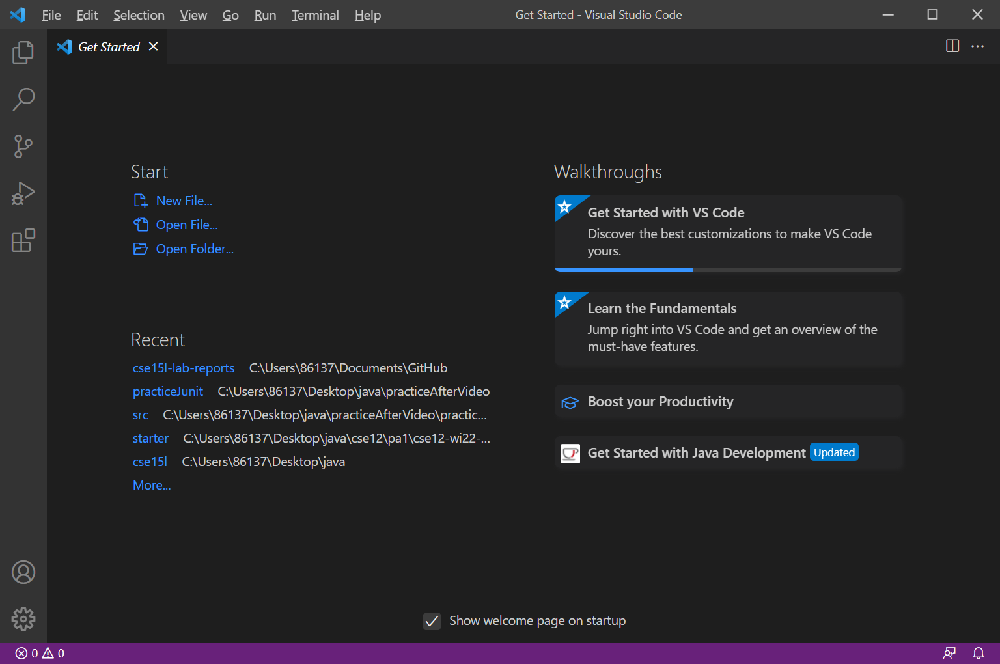
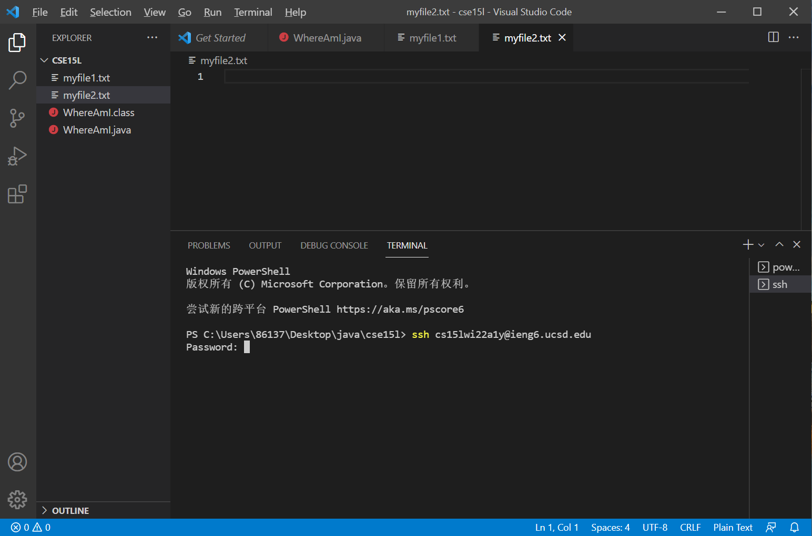
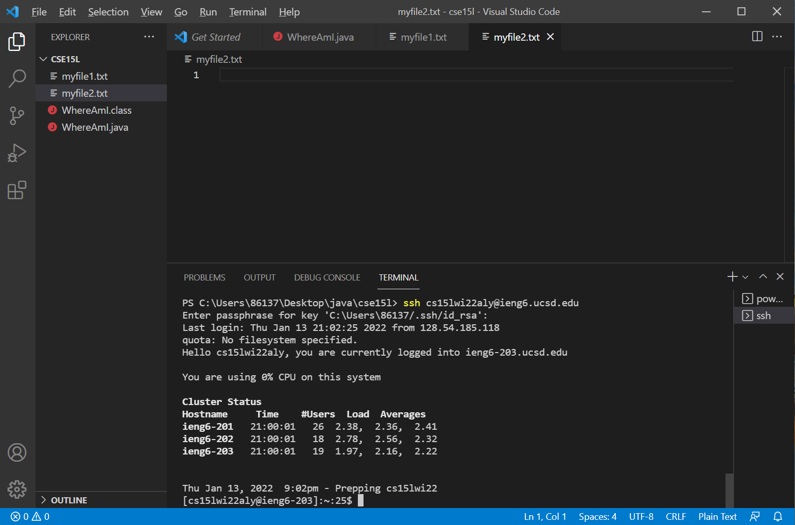
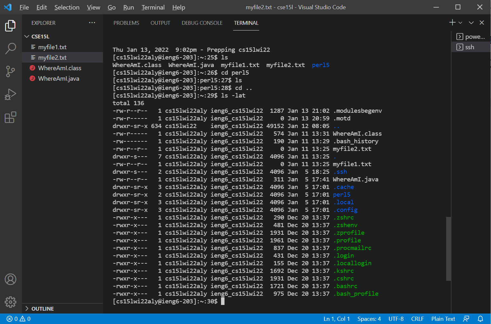
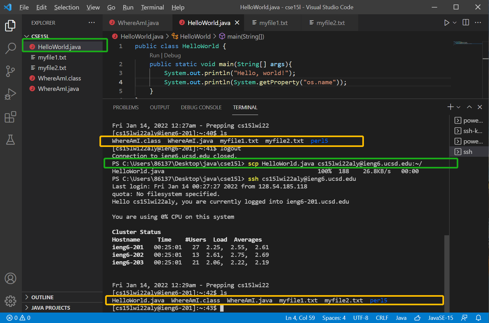
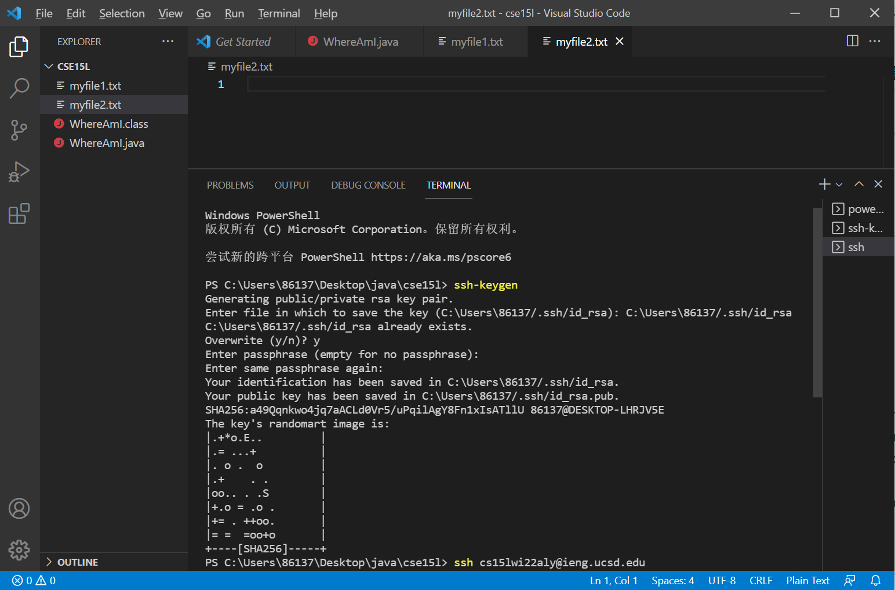
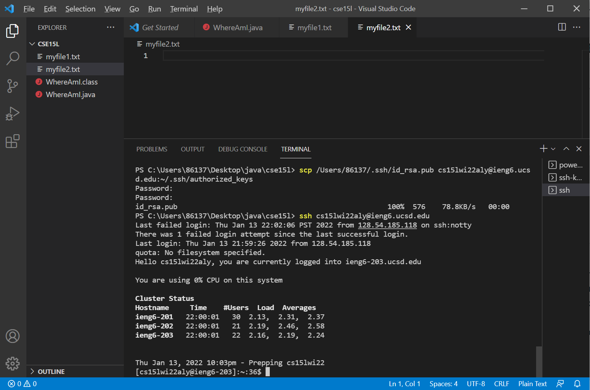
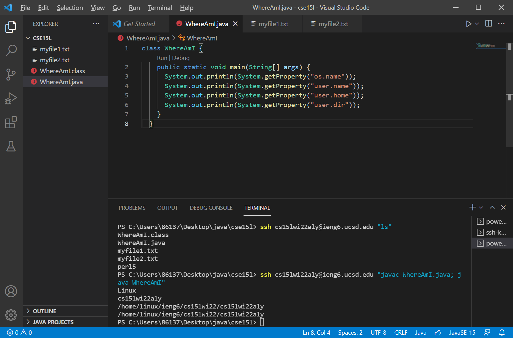

<div style="text-align:center;background-color:#e0ffff;">
    <p style="font-family:Times New Roman;font-size:60px" > <b>CSE15L lab 1</b></p>
    <p style="color:blue;font-style:italic;font-size:20px"> How to log into a course-specific account </p> 
</div>


# **Step 1: Installing Visual Studio Code**
>VS Code can be downloaded in this [official website](https://code.visualstudio.com/). 
After downloading and installing VS Code on your own computer, we launch the software: 



>We can then use many features provided by VS Code. 

------
# **Step 2: Remotely Connecting**
>We are now trying to connect to your account. Be sure to check OpenSSH has been installed if your OS is Windows. You should have your own course-specific account: cs15l%%%%\*\*\*@ieng6.ucsd.edu, where %%%% is your current quarter (wi22 for example) and \*\*\* is  your own folder for this course. 
 
 >After getting your own folder and setting up the password, enter this command to your terminal and press enter: 
 
            $ssh cs15l%%%%***@ieng6.ucsd.edu



>Now enter your password. Notice that when you types in or paste your password, there may be no changes happening on the screen.

>If everything goes well, you should be able to see this message:



>Congrats! You have successfully logged in into the server!

------------
# **Step 3: Trying some commands**
>Feel free to type in commands as the following ones:
```
$ cd ~
```
* returns you to your user account's home folder
```
$ cd ..
```
* returns you to the parent directory
```
$ ls -lat
```
* list all files according to time created
```
$ ls -a
```
* list all files and directories, including hidden ones.


>The following are some results of my commands:



--------
# **Step 4: Moving files with scp command**
>You can use the scp command to copy a file from your computer to remote server. Take a look at the following example:



>We first list the file:
```
$ ls
```

>On our local directory, we use the following command:
```
$ scp WhereAmI.java cs15l%%%%***@ieng6.ucsd.edu:~/
```
>Then we list the file again with this command:
```
$ ls
```

>We can see in the yellow boxes that *ls* gives different results on the server, indicating that HelloWorld.java has been copied.


----------
# **Step 5: Setting an SSH key**
>Every time want to operate on the server, we need to type in the password: 


>We don't want that happen. Luckily we have an SSH key that can help. All we need to do is shown here: 



```
$ ssh-keygen
```

>*ssh-keygen* generates the private key (id_rsa) and the public key (id_rsa.pub), After we specify where to put the .ssh directory that contain these files and set passphrase, we need to *scp* the **public** key to the .ssh directory on the server.

```
$ ssh cs15lwi22zz@ieng6.ucsd.edu
<Enter Password>
# now on server
$ mkdir .ssh
$ <logout>
# back on client
$ scp <path for id_rsa.pub> cs15l%%%%***@ieng6.ucsd.edu:~/.ssh/authorized_keys
# You use your username and the path you saw in the command above
```

>The expected results are shown here:



>We can see that, after successfully completed the *scp* command, we no longer need to enter the password when using *ssh* command to access the server.

# **Step 6: Making remote running even more pleasant**

>Sometimes we only want to perform one operation on the server and immediately log out. We can use the following command to save time:



```
$ ssh cs15l%%%%***@ieng6.ucsd.edu "ls"
```
>We can see that *ls* listed the files we have on the server. We call the command on our local directory and, after the call, we are still in our local directory. We do not remain in the server.

```
$ ssh cs15l%%%%***@ieng6.ucsd.edu "javac WhereAmI.java; java WhereAmI"
```

>On the second command, *ssh* compiles and runs WhereAmI.java. From the results that are printed out, we can tell that the compile-and-run process was finished on the server, since the OS is *linux* but not *Windows* (my pc is Windows). Before and after the command, we all stay in our local directory, while the java program was run on the server.

>Without the above techniques, we will have to log in, type in all commands and log out. For the first example we would need 3 commands:
```
$ ssh cs15l%%%%***@ieng6.ucsd.edu
$ ls
$ logout
```
While now we only need to write 1 line of command, which saves us 2 keystrokes of "Enter". We will save more keystrokes given that we don't need to type in "logout" now.

For the second example, we used to type in the following:
```
$ ssh cs15l%%%%***@ieng6.ucsd.edu
$ javac WhereAmI.java
$ java WhereAmI
$ logout
```
We still need only 1 line of command now, saving 3 keystrokes of "Enter" and 6 keystrokes of "logout" command.

>This trick helps us save not only keystrokes, but also waiting time, since there's hardly any pausing between these commands now.

# **Hope you successfully get everything to work!**