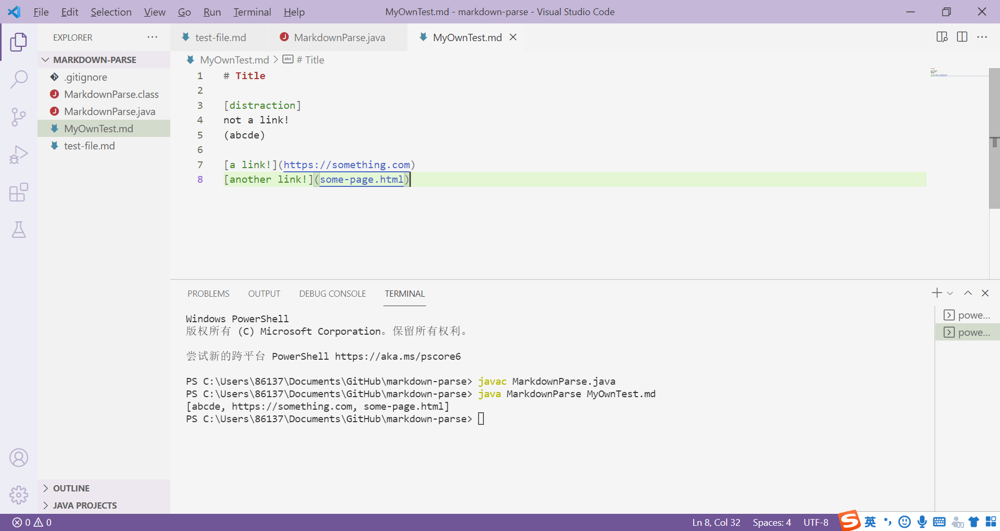
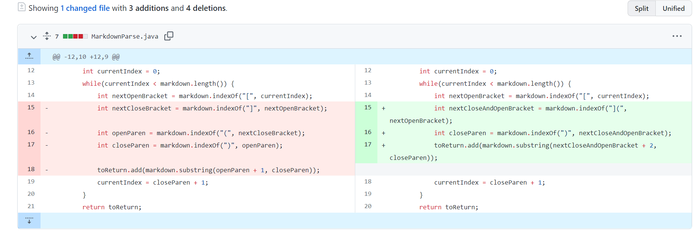
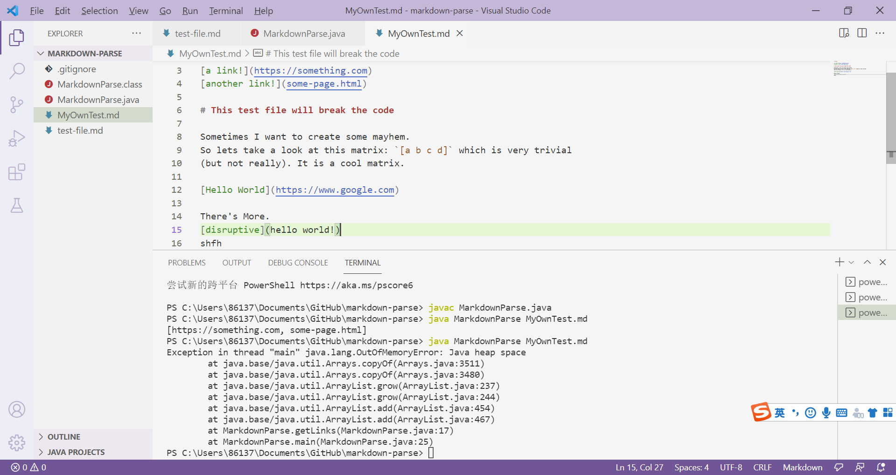
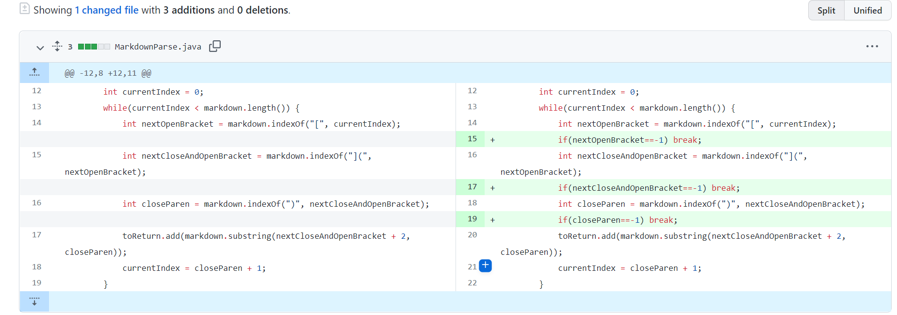
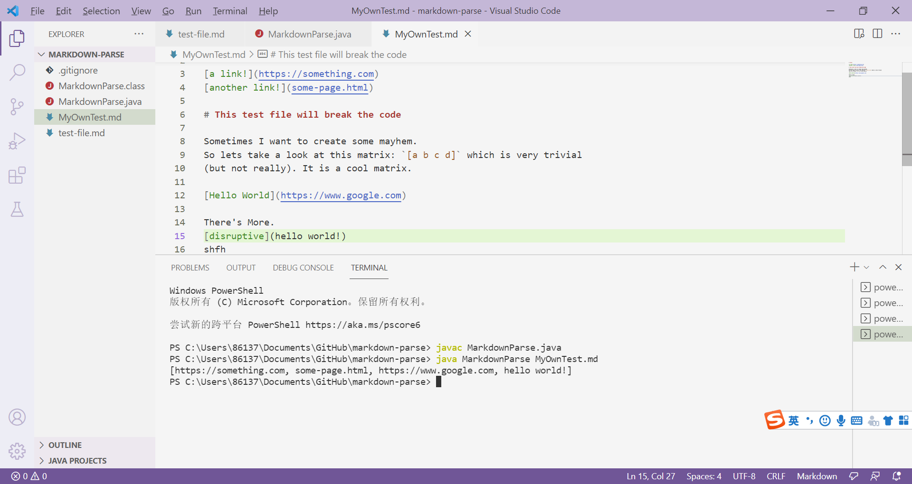
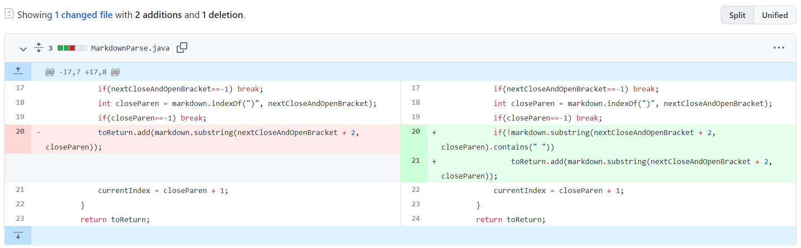
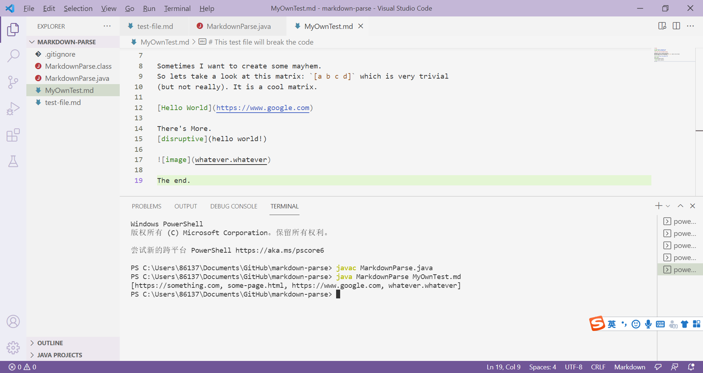
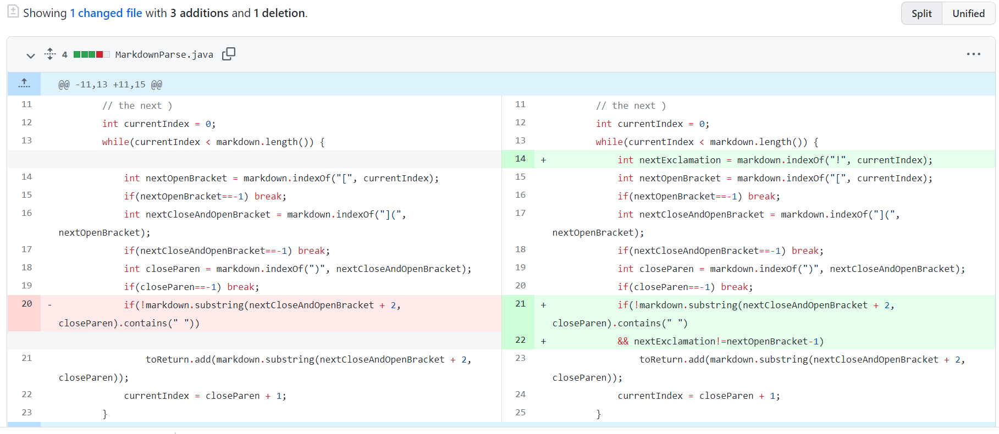

<div style="text-align:center;background-color:#e0ffff;">
    <p style="font-family:Times New Roman;font-size:60px" > <b>CSE15L lab 2</b></p>
    <p style="color:blue;font-style:italic;font-size:20px"> How to fix a bug </p> 
</div>

# **Original Code And Test File**
> Original Code:

```
// File reading code from https://howtodoinjava.com/java/io/java-read-file-to-string-examples/
import java.io.IOException;
import java.nio.file.Files;
import java.nio.file.Path;
import java.util.ArrayList;

public class MarkdownParse {
    public static ArrayList<String> getLinks(String markdown) {
        ArrayList<String> toReturn = new ArrayList<>();
        // find the next [, then find the ], then find the (, then take up to
        // the next )
        int currentIndex = 0;
        while(currentIndex < markdown.length()) {
            int nextOpenBracket = markdown.indexOf("[", currentIndex);
            int nextCloseBracket = markdown.indexOf("]", nextOpenBracket);
            int openParen = markdown.indexOf("(", nextCloseBracket);
            int closeParen = markdown.indexOf(")", openParen);
            toReturn.add(markdown.substring(openParen + 1, closeParen));
            currentIndex = closeParen + 1;
        }
        return toReturn;
    }
    public static void main(String[] args) throws IOException {
		Path fileName = Path.of(args[0]);
	    String contents = Files.readString(fileName);
        ArrayList<String> links = getLinks(contents);
        System.out.println(links);
    }
} 
```

> Original Test File:

```
# Title

[a link!](https://something.com)
[another link!](some-page.html)
```

# **Bug 1**
> This is the [link](MyOwnTest1.md)  to the test file. [Raw text](https://raw.githubusercontent.com/yug030/cse15l_lab_report_2/main/MyOwnTest1.md) over here.

> Symptom:
For the distraction part, the program include the text inside the `( )` in the links, while the `( )` does not come immediately after `[ ]`.



# **Code Change 1**



> The bug occurs because the previous code only check for whether there's a "(" after a previous "]", and "(" don't have to be immediately after "]" (There's no check with nextOpenBracket and nextParen). As a result, so long as there's an unpaired "[" and "]", the previous code will regard all text inside the next "(" and ")" as a link. As a result, "abcde" was included. We fix this error by checking "](" together instead of checking "]" and "(" respectively.

# **Bug 2**
> This is the [link](MyOwnTest2.md)  to the test file. [Raw text](https://raw.githubusercontent.com/yug030/cse15l_lab_report_2/main/MyOwnTest2.md) over here.

> Symptom:
After running for about 30 seconds, the program throws an OutOfMemoryError.



# **Code Change 2-1**



> The bug occurs because the program cannot exit the while loop. The previous code use
 `currentIndex < markdown.length()` 
as the break condition for the while loop, which only works when the file end with ")". In this test file, the file does not end with ")", giving `currentIndex` the chance to change back to -1 and keep running in the loop. By breaking the loop when `currentIndex == -1` (indicating no matching found in the rest of the file), we can avoid the problem.

>Now we get the following output:



We can clearly see that though satisfying our format for a link, `hello world!` is actually not a link (because it contains spaces, which should not appear in links). Therefore we need to edit our judgement for the link.

# **Code Change 2-2**



> The bug occurs because in the previous program we just take the substring inside "(" and ")" as the link without performing additional checks. Given the symptom of wrongly including links with spaces, we add a condition in `if` to check that no space is inside the parenthesis.

# **Bug 3**
> This is the [link](MyOwnTest3.md)  to the test file. [Raw text](https://raw.githubusercontent.com/yug030/cse15l_lab_report_2/main/MyOwnTest3.md) over here.

> Symptom:
The markdown file contains an image in the format ``, the program wrongly include the text inside the `()` as link. 



# **Code Change 3**



> The bug occurs because our algorithm to extract links will be interfered by images in markdown since the grammar are quite similar.
The previous code look for code segments similar to `[#description#](#textWithoutSpace#)`, and did not take the `!` in front of the segment into account.
There was no check for this edge case.
After editing our code, we compare `nextExclamation` and `nextOpenBracket` in `if` conditions, we can tell whether the next `!` and `[` are separate or should be interpreted as together.