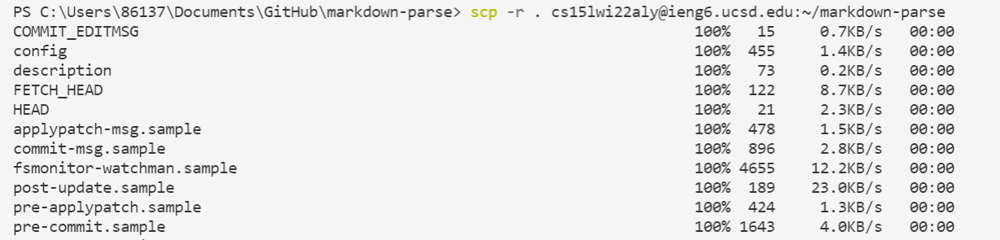
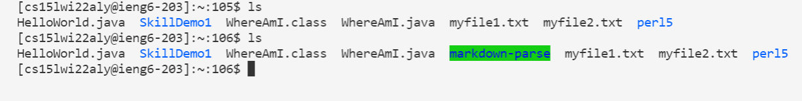
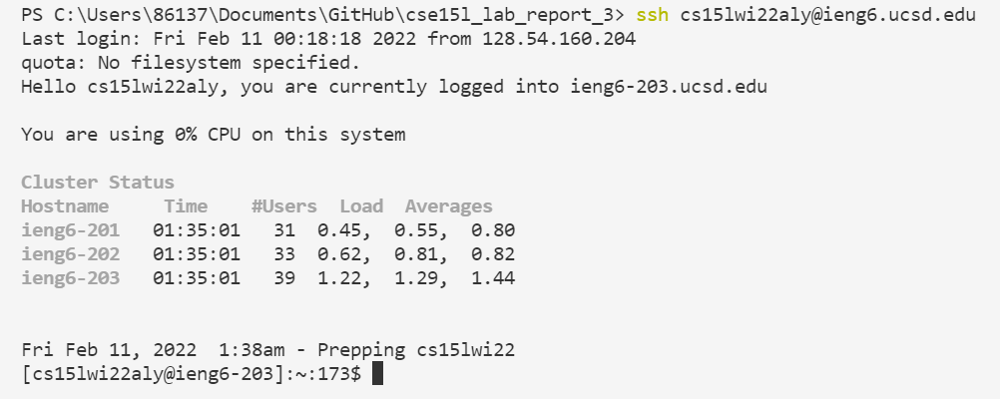
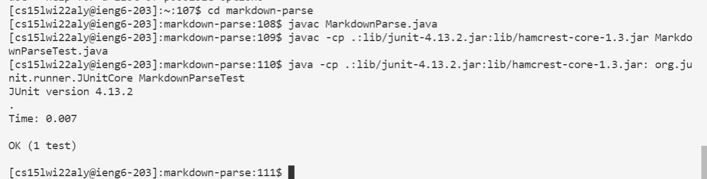
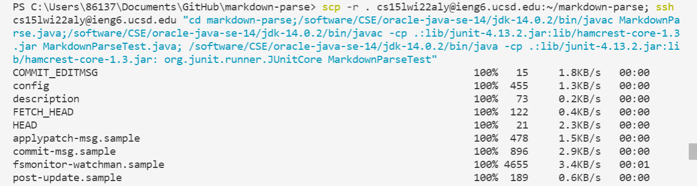
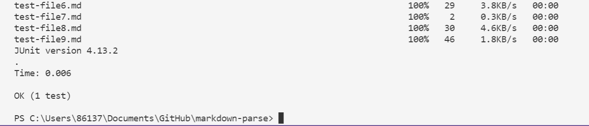

<div style="text-align:center;background-color:#e0ffff;">
    <p style="font-family:Times New Roman;font-size:60px" > <b>CSE15L lab 3</b></p>
    <p style="color:blue;font-style:italic;font-size:20px"> Group Choice Option 3: Copy whole directories with scp -r </p> 
</div>

# **Copy the whole directory to my account**
> Code used:

```
scp -r . cs15lwi22aly@ieng6.ucsd.edu:~/markdown-parse
```

> The code copies the current directory onto the **ieng6** account directory **markdown-parse**.



> Before and after the scp command:




# **Log into my ieng6 account**

> Code used:

```
ssh cs15lwi22aly@ieng6.ucsd.edu
```



# **Compile and run the tests for my repository**

> Code used:

```
cd markdown-parse
javac MarkdownParse.java
javac -cp .:lib/junit-4.13.2.jar:lib/hamcrest-core-1.3.jar MarkdownParseTest.java
java -cp .:lib/junit-4.13.2.jar:lib/hamcrest-core-1.3.jar: org.junit.runner.JUnitCore MarkdownParseTest
```

> We first change current directory to the copied directory, then use `javac` and `java` commands to compile and run the tests:



# **Combine `scp`, `;`, and `ssh` to copy the whole directory and run the tests in one line**
> Code used:

```
scp -r . cs15lwi22aly@ieng6.ucsd.edu:~/markdown-parse; ssh cs15lwi22aly@ieng6.ucsd.edu "cd markdown-parse;/software/CSE/oracle-java-se-14/jdk-14.0.2/bin/javac MarkdownParse.java;/software/CSE/oracle-java-se-14/jdk-14.0.2/bin/javac -cp .:lib/junit-4.13.2.jar:lib/hamcrest-core-1.3.jar MarkdownParseTest.java; /software/CSE/oracle-java-se-14/jdk-14.0.2/bin/java -cp .:lib/junit-4.13.2.jar:lib/hamcrest-core-1.3.jar: org.junit.runner.JUnitCore MarkdownParseTest"
```

> The commands are typed in one line with `;` as the separator. Due to a java version conflict, we have to use `/software/CSE/oracle-java-se-14/jdk-14.0.2/bin/java` to replace the normal `java` command, and `/software/CSE/oracle-java-se-14/jdk-14.0.2/bin/javac` to replace `javac` when running in a single command.



