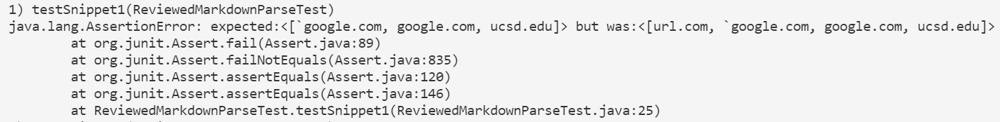
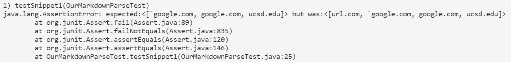
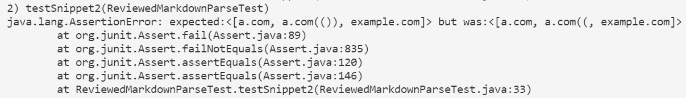
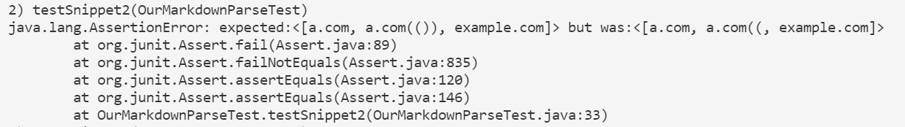
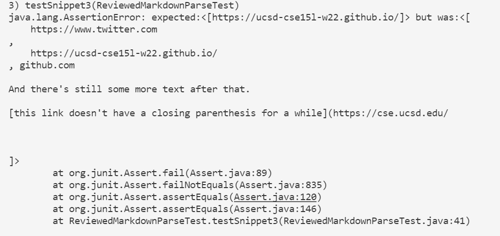
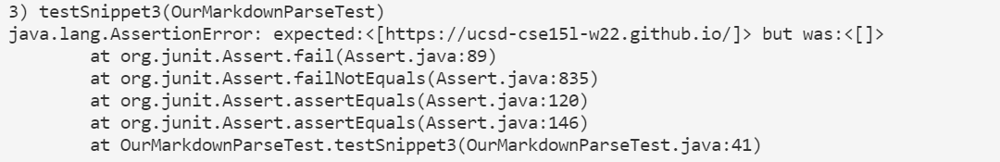

<div style="text-align:center;background-color:#e0ffff;">
    <p style="font-family:Times New Roman;font-size:60px" > <b>CSE15L lab 4</b></p>
    <p style="color:blue;font-style:italic;font-size:20px"> Editing MarkdownParse</p> 
</div>

> This is the link to [my implementation](https://github.com/yug030/markdown-parse) of markdown-parse, and [the implementation I reviewed](https://github.com/codyprupp/markdown-parse). Expected links are generated from the [the CommonMark demo site](https://spec.commonmark.org/dingus/).


# Snippet1

> This is the [link to Snippet1.md (raw text)](https://raw.githubusercontent.com/yug030/cse15l_lab_report_4/main/Snippet1.md):

> Here is the test code:


```java
    @Test
    public void testSnippet1() throws IOException{
        Path fileName = Path.of("Snippet1.md");
	    String contents = Files.readString(fileName);
        List<String> expected = List.of("`google.com", "google.com", "ucsd.edu");
        assertEquals(expected, OurMarkdownParse.getLinks(contents));
    }
```
## The Implementation I Reviewed:

> It does not pass and the Junit output is shown below:



> Expected output: ```[`google.com, google.com, ucsd.edu]```

> Actual output: ```[url.com, `google.com, google.com, ucsd.edu]```

## My Implementation:

> It does not pass and the Junit output is shown below:



> Expected output: ```[`google.com, google.com, ucsd.edu]```


> Actual output: ```[url.com, `google.com, google.com, ucsd.edu]```

In my implementation, a small change can be made to address the problem created by backticks. We can see from the expected output that none of the left bracket `[` and the right bracket `]` inside two backsticks will be counted as valid pattern for links. Therefore, we can keep track of the text is inside backticks and only look for `[` and `]` outside the backticks.

# Snippet2

> This is the [link to Snippet2.md (raw text)](https://raw.githubusercontent.com/yug030/cse15l_lab_report_4/main/Snippet2.md):

> Here is the test code:


```java
    @Test
    public void testSnippet2() throws IOException{
        Path fileName = Path.of("Snippet2.md");
	    String contents = Files.readString(fileName);
        List<String> expected = List.of("a.com", "a.com(())", "example.com");
        assertEquals(expected, OurMarkdownParse.getLinks(contents));
    }
```
## The Implementation I Reviewed:

> It does not pass and the Junit output is shown below:



> Expected output: ```[a.com, a.com(()), example.com]```

> Actual output: ```[a.com, a.com((, example.com]```

## My Implementation:

> It does not pass and the Junit output is shown below:



> Expected output: ```[a.com, a.com(()), example.com]```

> Actual output: ```[a.com, a.com((, example.com]```

In my implementation, a small change can be made to address the problem created by nest parentheses, brackets, and escaped brackets. After we find matched `[` `]` and subsequent `(`, we can add a stack to find the matched right parenthese `)` without the interference of nest parentheses inside the potential link.

# Snippet3

> This is the [link to Snippet3.md (raw text)](https://raw.githubusercontent.com/yug030/cse15l_lab_report_4/main/Snippet3.md):

> Here is the test code:


```java
    @Test
    public void testSnippet3() throws IOException{
        Path fileName = Path.of("Snippet3.md");
	    String contents = Files.readString(fileName);
        List<String> expected = List.of("https://ucsd-cse15l-w22.github.io/");
        assertEquals(expected, OurMarkdownParse.getLinks(contents));
    }
```
## The Implementation I Reviewed:

> It does not pass and the Junit output is shown below:



> Expected output: ```[https://ucsd-cse15l-w22.github.io/]```

> Actual output: 

```
[
    https://www.twitter.com
,
    https://ucsd-cse15l-w22.github.io/
, github.com

And there's still some more text after that.

[this link doesn't have a closing parenthesis for a while](https://cse.ucsd.edu/


]
```

## My Implementation:

> It does not pass and the Junit output is shown below:



> Expected output: ```[https://ucsd-cse15l-w22.github.io/]```

> Actual output: ```[]```

In my implementation, a small change can be made to address the problem created by newlines in brackets and parentheses. After we find matched `[` `]` and subsequent matched `(` and `)`, we can change the way we view links: the blank spaces and **single** newlines immediately after `(` and just before `)` can be ignored. So long as the middle part does not contain spaces and newlines, and the text part inside the brackets `[]` does not contains **any empty lines**, it can be viewed as a valid link.

> A valid link example:
```
[Single newlines: valid link](          # a single tap of "Enter" here
     ucsd.edu                           # single tap of "Enter"
     )
```

> An invalid link example:
```
[Empty lines: invalid link]( 
                                        # here's an "empty" line
     ucsd.edu 
     )
```