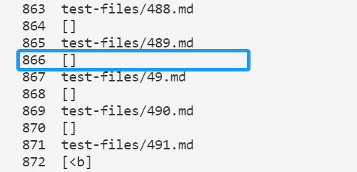
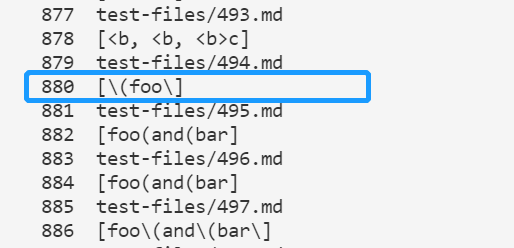
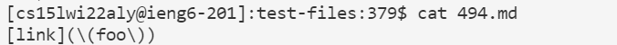

<div style="text-align:center;background-color:#e0ffff;">
    <p style="font-family:Times New Roman;font-size:60px" > <b>CSE15L lab 5</b></p>
    <p style="color:blue;font-style:italic;font-size:20px"> Finding the difference and debugging</p> 
</div>

> We can run all test files with the code shown below:

```
for file in test-files/*.md;
do
  echo $file
  java MarkdownParse $file
done
```

> The code above in `script.sh` can run the program on all `.md` files in the directory `test-files`.With the command `bash script.sh > results.txt`, we can store all outputs inside the file `results.txt` and perform easy comparisons with the file that contains all outputs.

> For two coutput files, we use the following command to compare the differences:

```
diff <Path A> <Path B> 
```

Here I use the command `diff my-markdown-mdparse/results.txt markdown-parse/results.txt`:


> The output can tell us which lines and the content are different. Tests with different results are shown here. For example, the first line `212c212` means the line 212 in the first file differs from line 212 in the second file. The second and fourth line shows that that line is `[url]` in the first file but is `[]` in the second file and so on. 

> We will discuss about 2 different outputs here.

# Difference 1

> For the difference between line 866 (markdown-parse/results.txt) and line 866 & 867 (my-markdown-parse/results.txt), we first check which test file leads to the difference. We can use the following command:

```
cat -n results.txt
```

> The command will display `results.txt` in the terminal while showing the lines, which can help us locate the test file much more efficiently. The output is shown below:

> In markdown-parse:



> In my-markdown-parse:


> Clearly the difference is on the test file `489.md`. We open it with command `cat 489.md`:


> According to [the CommonMark demo site](https://spec.commonmark.org/dingus/), this should not be a link. The expected output should be `[]`. If there are any spaces or newlines inside the parentheses, the content should not be treated as a link. Our implementation should be missing the checking for `\n` in between the parentheses, which leads to the wrong output.


> Part of the implementation in markdown-parse:

```java
    String potentialLink = markdown.substring(openParen + 1, closeParen).trim();
    if(potentialLink.indexOf(" ") == -1 && potentialLink.indexOf("\n") == -1) {
        toReturn.add(potentialLink);
        currentIndex = closeParen + 1;
    }
```
> Part of the implementation in my-markdown-parse (ours):

```java
    String link = markdown.substring(nextCloseBracketAndOpenParen + 2, closeParen).trim();
    if (!link.contains(" ")) {
        toReturn.add(link);
    }
```

> Our assumption is correct. By adding a checking for `\n` in `link`, we can fix the bug for this test. 

# Difference 2

> For the difference between line 878 (markdown-parse/results.txt) and line 880 (my-markdown-parse/results.txt), we first check which test file leads to the difference. By using the same command `cat -n results.txt`, `results.txt` will be dispalyed in the terminal while showing the lines. The output is shown below:

> In markdown-parse:


> In my-markdown-parse:



> Clearly the difference is on the test file `494.md`. We open it with command `cat 494.md`:



> According to [the CommonMark demo site](https://spec.commonmark.org/dingus/), this should be a link, and the expected output should be `[(foo)]`. The backslash symbol `\` here is used as an escape charater. When we recheck both outputs, we can conclude that both implementations have a bug here.


> Part of the implementation in markdown-parse:

```java
    static int findCloseParen(String markdown, int openParen) {
        int closeParen = openParen + 1;
        int openParenCount = 1;
        while (openParenCount > 0 && closeParen < markdown.length()) {
            if (markdown.charAt(closeParen) == '(') {
                openParenCount++;
            } else if (markdown.charAt(closeParen) == ')') {
                openParenCount--;
            }
            closeParen++;
        }
        if(openParenCount == 0) {
          return closeParen - 1;
        }
        else {
          return -1;
        }
    }
```
> Part of the implementation in my-markdown-parse (ours):

```java
    int closeParen = markdown.indexOf(")", nextCloseBracketAndOpenParen);
```

> Our assumption is correct. None of the implementations treat the backslash as an escape character. To fix the bug (say we want to fix the implementation in `markdown-parse`) we can keep track of the backslash symbol `\` and ignore the parenthesis immediately after it. We will not include these parentheses in our matchings. In the link, however, we will include these parentheses immediately after `\` while ignoring the backslashes.